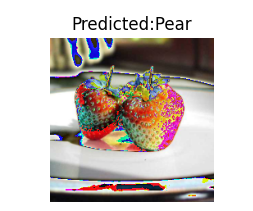

**Comparison Table (for 25 epochs)**

| |Training time | Training loss | Training accuracy | Testing accuracy | No of model parameters|
|-|--- | --- | --- | --- | --- |
|VGG (1 block)| 21m 42s |  0.048715802282094954 | 99.375 | 95.0% | 163907330 |
|VGG (3 blocks)| 22m 11s | 0.2673647880554199  | 90.625 | 97.5.0% | 103117634 |
|VGG (3 blocks) with data augmentation | 44m 40s |  0.16372035369277 | 93.75 | 100.0% | 103117634 |
|Transfer learning using VGG16| 26m 38s | 0.00017252258185180837 | 100 | 100.0% | 134268738 |
|MLP| 23m 21s | 0.0035812978865578772  | 100 | 95 | 134283359 |

**Q.1 Are the results as expected? Why or why not?**

VGG with 1 block: Here this model has larger parameters than all but it has only 1 convolution layer due to which it gives minimal accuracy among all, it may be faster to train and less prone to overfitting. However, if we decrease parameters and come close to VGG3, the accuracy may decrease it will have lesser advantage of convolution layer and will not perform as par.

VGG with 3 blocks: Here the model has lesser parameters among all due to 3 blocks of convolution and lesser fully connected layer, which results in better accuracy than VGG1 and MLP as it has more advantage of convolution layers (beneficial when working with images) than both

VGG with 3 blocks with data augmentation: Data augmentation can help to improve accuracy by creating more training data and increasing the model's ability to generalize. However, it may also increase training time.Hence it has more training time due to more training data as well as more test accuracy than VGG1, VGG3 and MLP. If we increase epochs, the accuracy may also improve

VGG16: This model has even more parameters and is more complex than VGG with 3 blocks, so it have even higher accuracy on more complex datasets. However, it is also slower to train and more prone to overfitting. But here test data is small, so it is giving 100% but significant difference can be seen if dataset is large abd different. Also it is the best among all the models for large datasets

Fully connected neural network: A fully connected neural network may have lower accuracy on image classification tasks compared to convolutional neural networks like VGG, as it is less effective at detecting local features in images.

As we increase dataset we can the significant difference among the architectures

**Q.2 Does data augmentation help? Why or why not?**
Yes, data augmentation can help increase the performance of a model in many cases. Data augmentation is the process of artificially increasing the size of a dataset by generating new examples that are similar to the original data but have slight variations.

The main reason why data augmentation can help increase the performance of a model is that it can improve the model's ability to generalize to new, unseen data. By increasing the amount and diversity of the training data, data augmentation can help reduce overfitting, which occurs when a model becomes too specialized in the training data and is unable to perform well on new data.

For example, in image classification tasks, data augmentation techniques like random rotation, cropping, and flipping can help the model learn to recognize objects from different perspectives and orientations.

However, it is important to note that not all data augmentation techniques will be effective for every dataset or model. Some techniques may even harm performance if they introduce too much noise or distortions that make the data too different from the original samples. Therefore, it is important to carefully choose and evaluate data augmentation techniques based on the specific task and dataset.

**Q.3 Does it matter how many epochs you fine tune the model? Why or why not?**

Yes, the number of epochs used for fine-tuning a model can significantly impact the performance of the model.

Fine-tuning involves taking a pre-trained model and continuing its training on a new dataset that is related to the original task. The goal of fine-tuning is to adapt the pre-trained model's knowledge to the new dataset and improve its performance on the new task.

The number of epochs used for fine-tuning should be chosen based on the size and complexity of the new dataset and the complexity of the pre-trained model. Fine-tuning for too few epochs may result in the model not learning enough from the new data, while fine-tuning for too many epochs may lead to overfitting on the training data and poor generalization to new data.

If the new dataset is small or similar to the original training data, then fine-tuning for a few epochs may be sufficient to achieve good performance. However, if the new dataset is large or significantly different from the original training data, then fine-tuning for more epochs may be necessary to capture the nuances of the new data.

It is also important to monitor the performance of the model on a validation set during fine-tuning and stop training when the validation performance begins to plateau or decline. This can help prevent overfitting and ensure that the model generalizes well to new data.

In summary, the number of epochs used for fine-tuning a model should be chosen based on the size and complexity of the new dataset and the complexity of the pre-trained model, and should be monitored carefully to prevent overfitting.

**Q.4  Are there any particular images that the model is confused about? Why or why not?**

In above image, for models VGG1 and MLP, both have classified it wrong. May be the stem and leaf pattern detected it as **Pear**
